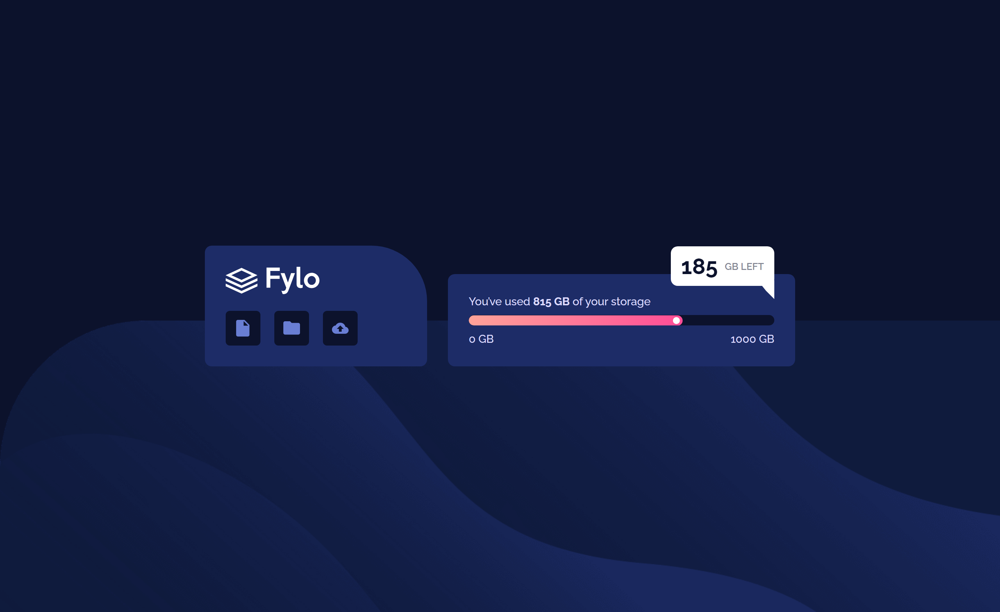
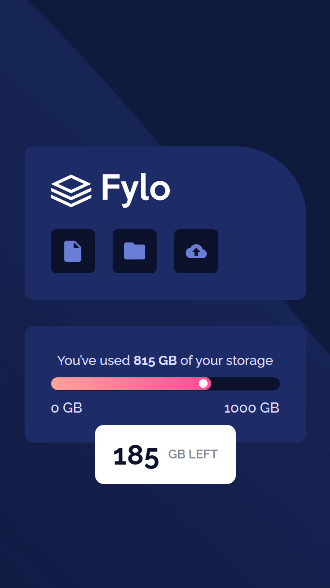

# Frontend Mentor - Fylo data storage component solution

This is a solution to the [Fylo data storage component challenge on Frontend Mentor](https://www.frontendmentor.io/challenges/fylo-data-storage-component-1dZPRbV5n). Frontend Mentor challenges help you improve your coding skills by building realistic projects. 

## Overview

### Links

- Solution URL: [Github](https://github.com/Affan840/Fylo-Data-Storage-Component)
- Live Site URL: [Live Preview](https://affan840.github.io/Fylo-Data-Storage-Component/)

### Screenshot

## Desktop

## Mobile

### Built with

- Semantic HTML5 markup
- CSS custom properties
- Flexbox
- JavaScript

## Author

- Instagram - [@muhammad__affan07](https://www.instagram.com/muhammad__affan07/)